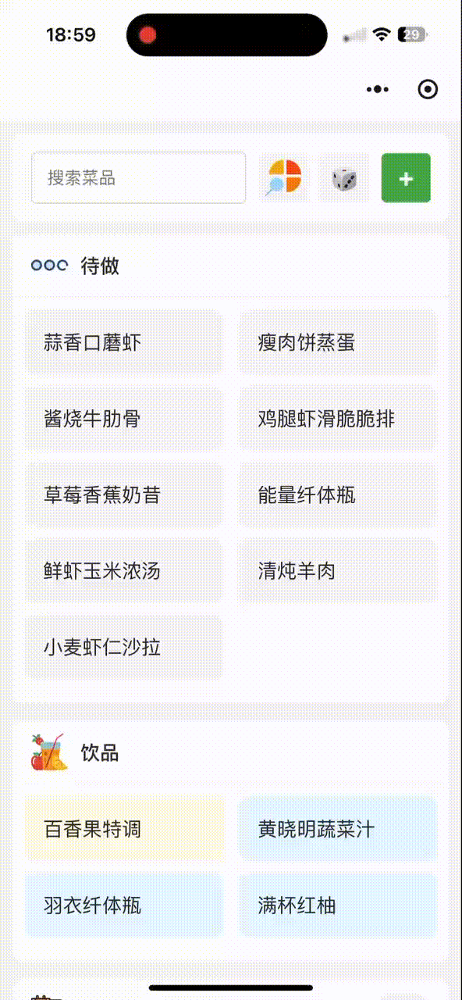

# Recipe Mini Program 菜谱小程序

<p align="center">
  
</p>

[English](#english) | [中文](#chinese)

---

## English

### 📱 Project Overview

**Recipe Mini Program** is a WeChat Mini Program that provides users with a comprehensive recipe management system. Users can browse, search, and manage recipes with an intuitive interface designed for Chinese cuisine enthusiasts.

### ✨ Features

- **Recipe Browsing**: Browse recipes organized by categories (beef, chicken, seafood, vegetables, etc.)
- **Smart Filtering**: Filter recipes by type, user contributions, and search text
- **Recipe Management**: Add, edit, and organize recipes with custom categories
- **Image Support**: Rich image support for recipe visualization
- **Responsive Design**: Optimized for mobile devices with smooth animations
- **Real-time Updates**: Dynamic content loading and real-time data synchronization

### 🏗️ Architecture

- **Frontend**: WeChat Mini Program (WXML, WXSS, JavaScript)
- **Backend**: AWS Lambda with API Gateway
- **Database**: DynamoDB for recipe storage
- **Deployment**: Serverless architecture on AWS

### 🚀 Getting Started

#### Prerequisites

- WeChat Developer Tools
- AWS Account (for backend deployment)
- Node.js (for development)

#### Installation

1. **Clone the repository**
   ```bash
   git clone [repository-url]
   cd RecipeMiniProgram
   ```

2. **Open in WeChat Developer Tools**
   - Launch WeChat Developer Tools
   - Import the project
   - Configure your AppID in `project.config.json`

3. **Configure Backend**
   - Update the API endpoint in `utils/api.js`
   - Deploy the backend services to AWS

4. **Run the application**
   - Click "Compile" in WeChat Developer Tools
   - Preview on mobile device or simulator

### 🔧 Configuration

#### API Configuration
1. **Copy the example configuration**
   ```bash
   cp config/config.example.js config/config.js
   ```

2. **Update the API endpoint in `config/config.js`**
   ```javascript
   API_ENDPOINT: 'https://your-api-gateway-url.execute-api.region.amazonaws.com'
   ```

3. **Never commit `config/config.js`** - it's already in `.gitignore`

#### App Configuration
Modify `app.json` to customize:
- Page routing
- Navigation bar style
- Renderer options
- Component framework settings

### 📱 Pages

#### Index Page (`pages/index/`)
- Main recipe listing with category filtering
- Search functionality
- Recipe type organization
- Add new recipe functionality

#### Detail Page (`pages/detail/`)
- Individual recipe information
- Ingredients and cooking steps
- Recipe editing capabilities

### 🎨 Components

#### Navigation Bar (`components/navigation-bar/`)
- Custom navigation component
- Responsive design
- Consistent UI across pages

### 🌐 API Integration

The application integrates with AWS backend services:

- **GET /dishes**: Retrieve all recipes
- **POST /dishes**: Add new recipe
- **PUT /dishes/{id}**: Update existing recipe
- **DELETE /dishes/{id}**: Remove recipe

### 🚀 Deployment

#### Frontend Deployment
1. Build the project in WeChat Developer Tools
2. Submit for review in WeChat Mini Program console
3. Deploy to production environment

#### Backend Deployment
1. Deploy AWS Lambda functions
2. Configure API Gateway
3. Set up DynamoDB tables
4. Configure CORS and security settings

---

## Chinese

### 📱 项目概述

**菜谱小程序** 是一个微信小程序，为用户提供全面的菜谱管理系统。用户可以浏览、搜索和管理菜谱，界面专为中国美食爱好者设计，操作直观简单。

### ✨ 功能特性

- **菜谱浏览**: 按类别浏览菜谱（牛肉、鸡肉、海鲜、蔬菜等）
- **智能筛选**: 按类型、用户贡献和搜索文本筛选菜谱
- **菜谱管理**: 添加、编辑和组织菜谱，支持自定义分类
- **图片支持**: 丰富的图片支持，提升菜谱可视化效果
- **响应式设计**: 针对移动设备优化，动画流畅
- **实时更新**: 动态内容加载和实时数据同步

### 🏗️ 架构设计

- **前端**: 微信小程序（WXML、WXSS、JavaScript）
- **后端**: 基于 AWS Lambda 和 API Gateway
- **数据库**: DynamoDB 用于菜谱存储
- **部署**: AWS 无服务器架构

### 🚀 快速开始

#### 前置要求

- 微信开发者工具
- AWS账户（用于后端部署）
- Node.js（用于开发）

#### 安装步骤

1. **克隆仓库**
   ```bash
   git clone [仓库地址]
   cd RecipeMiniProgram
   ```

2. **在微信开发者工具中打开**
   - 启动微信开发者工具
   - 导入项目
   - 在 `project.config.json` 中配置你的AppID

3. **配置后端**
   - 在 `utils/api.js` 中更新API端点
   - 将后端服务部署到AWS

4. **运行应用**
   - 在微信开发者工具中点击"编译"
   - 在移动设备或模拟器上预览

### 🔧 配置说明

#### API配置
1. **复制示例配置文件**
   ```bash
   cp config/config.example.js config/config.js
   ```

2. **在 `config/config.js` 中更新API端点**
   ```javascript
   API_ENDPOINT: 'https://你的API-Gateway地址.execute-api.区域.amazonaws.com'
   ```

3. **切勿提交 `config/config.js`** - 它已在 `.gitignore` 中

#### 应用配置
修改 `app.json` 来自定义：
- 页面路由
- 导航栏样式
- 渲染器选项
- 组件框架设置

### 📱 页面说明

#### 首页 (`pages/index/`)
- 主菜谱列表，支持类别筛选
- 搜索功能
- 菜谱类型组织
- 添加新菜谱功能

#### 详情页 (`pages/detail/`)
- 单个菜谱信息
- 配料和烹饪步骤
- 菜谱编辑功能

### 🎨 组件说明

#### 导航栏 (`components/navigation-bar/`)
- 自定义导航组件
- 响应式设计
- 跨页面一致的UI

### 🌐 API集成

应用程序与AWS后端服务集成：

- **GET /dishes**: 获取所有菜谱
- **POST /dishes**: 添加新菜谱
- **PUT /dishes/{id}**: 更新现有菜谱
- **DELETE /dishes/{id}**: 删除菜谱

### 🚀 部署说明

#### 前端部署
1. 在微信开发者工具中构建项目
2. 在微信小程序控制台提交审核
3. 部署到生产环境

#### 后端部署
1. 部署AWS Lambda函数
2. 配置API Gateway
3. 设置DynamoDB表
4. 配置CORS和安全设置

